# Flink Event Trigger Framework - Architecture Documentation

## Overview

This document describes the large-scale architecture of the Flink Event Trigger Framework for analyzing user tracking events. The system is designed to handle high-throughput event processing with stateful operations, where each user's state can grow up to 16MB.

## Table of Contents

1. [High-Level Architecture](#high-level-architecture)
2. [Flink Cluster Architecture](#flink-cluster-architecture)
3. [Event Flow and Data Pipeline](#event-flow-and-data-pipeline)
4. [State Management and Storage](#state-management-and-storage)
5. [Scaling Considerations](#scaling-considerations)

---

## High-Level Architecture

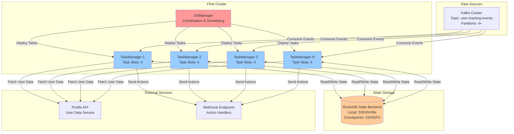

---

## Flink Cluster Architecture

### JobManager and TaskManager Relationship

```mermaid
graph TB
    subgraph "JobManager (Master Node)"
        JM_Scheduler[Job Scheduler]
        JM_Checkpoint[Checkpoint Coordinator]
        JM_ResourceMgr[Resource Manager]
        JM_Dispatcher[Dispatcher]
        
        JM_Scheduler --> JM_Checkpoint
        JM_Scheduler --> JM_ResourceMgr
        JM_Dispatcher --> JM_Scheduler
    end
    
    subgraph "TaskManager 1 (Worker Node)"
        TM1_Slot1[Task Slot 1<br/>Parallelism Instance]
        TM1_Slot2[Task Slot 2<br/>Parallelism Instance]
        TM1_Slot3[Task Slot 3<br/>Parallelism Instance]
        TM1_Slot4[Task Slot 4<br/>Parallelism Instance]
        TM1_Network[Network Buffers]
        TM1_Memory[Managed Memory<br/>RocksDB Cache]
    end
    
    subgraph "TaskManager 2 (Worker Node)"
        TM2_Slot1[Task Slot 1]
        TM2_Slot2[Task Slot 2]
        TM2_Slot3[Task Slot 3]
        TM2_Slot4[Task Slot 4]
        TM2_Network[Network Buffers]
        TM2_Memory[Managed Memory]
    end
    
    subgraph "TaskManager N (Worker Node)"
        TMN_Slot1[Task Slot 1]
        TMN_Slot2[Task Slot 2]
        TMN_Slot3[Task Slot 3]
        TMN_Slot4[Task Slot 4]
        TMN_Network[Network Buffers]
        TMN_Memory[Managed Memory]
    end
    
    JM_ResourceMgr -->|Allocate Slots| TM1_Slot1
    JM_ResourceMgr -->|Allocate Slots| TM1_Slot2
    JM_ResourceMgr -->|Allocate Slots| TM2_Slot1
    JM_ResourceMgr -->|Allocate Slots| TMN_Slot1
    
    JM_Checkpoint -->|Trigger Checkpoint| TM1_Slot1
    JM_Checkpoint -->|Trigger Checkpoint| TM2_Slot1
    JM_Checkpoint -->|Trigger Checkpoint| TMN_Slot1
    
    TM1_Slot1 -.->|Share Resources| TM1_Memory
    TM1_Slot2 -.->|Share Resources| TM1_Memory
    TM2_Slot1 -.->|Share Resources| TM2_Memory
    TMN_Slot1 -.->|Share Resources| TMN_Memory
    
    style JM_Scheduler fill:#ff9999
    style JM_Checkpoint fill:#ff9999
    style TM1_Slot1 fill:#99ccff
    style TM2_Slot1 fill:#99ccff
    style TMN_Slot1 fill:#99ccff
    style TM1_Memory fill:#ffcc99
    style TM2_Memory fill:#ffcc99
    style TMN_Memory fill:#ffcc99
```

### Job Deployment and Task Distribution

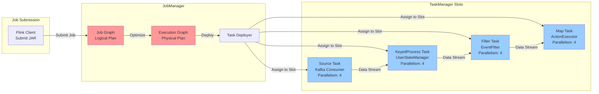

---

## Event Flow and Data Pipeline

### Kafka to Flink Event Dispatch

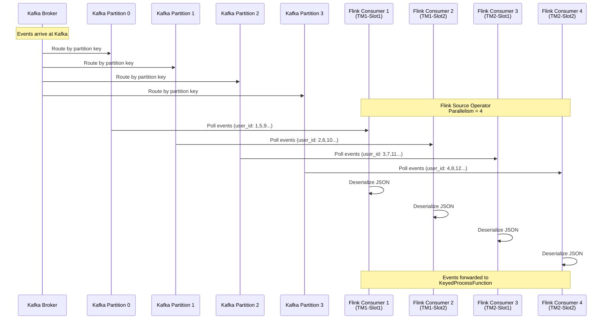

### Complete Event Processing Pipeline

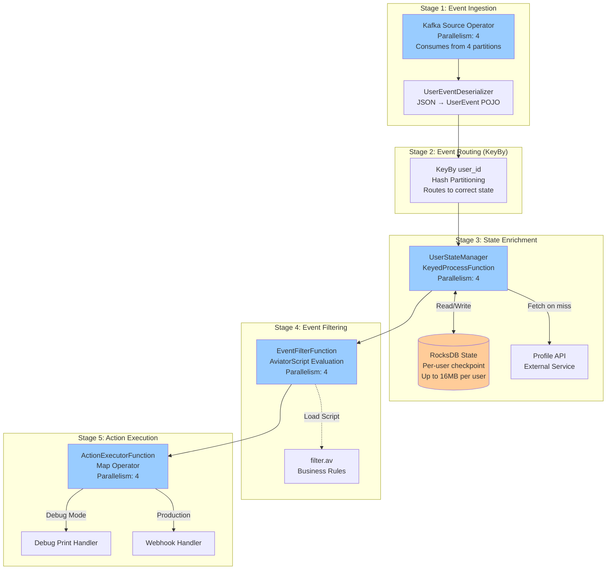

### Event Payload Flow Detail

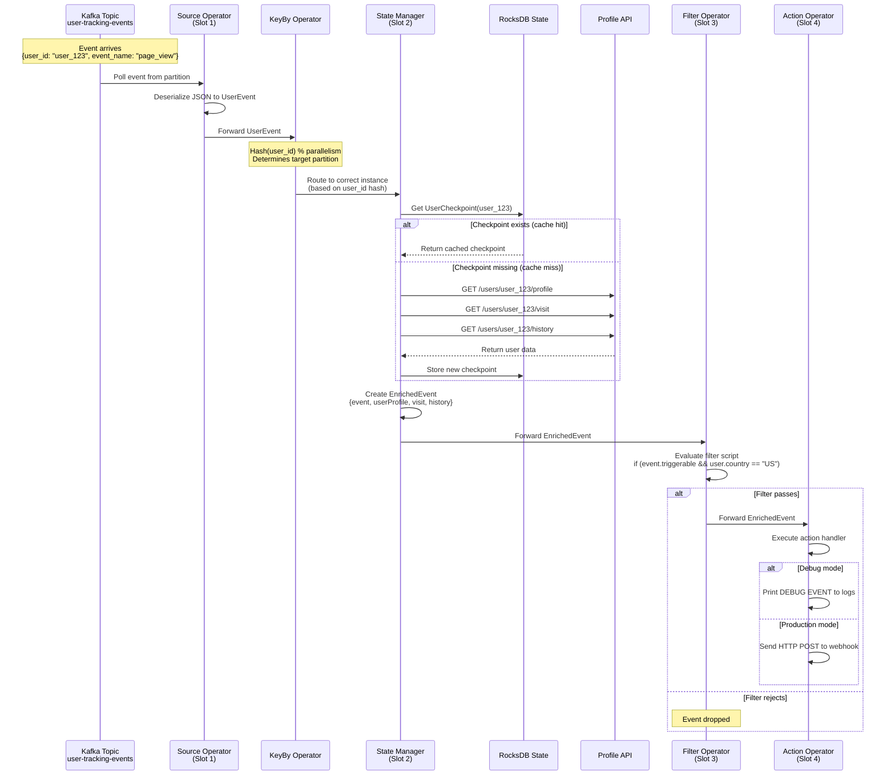

---

## State Management and Storage

### State Storage Architecture

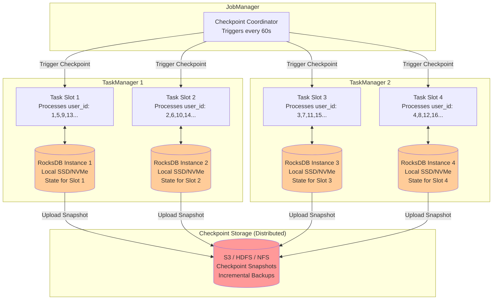

### State Size and Storage Requirements

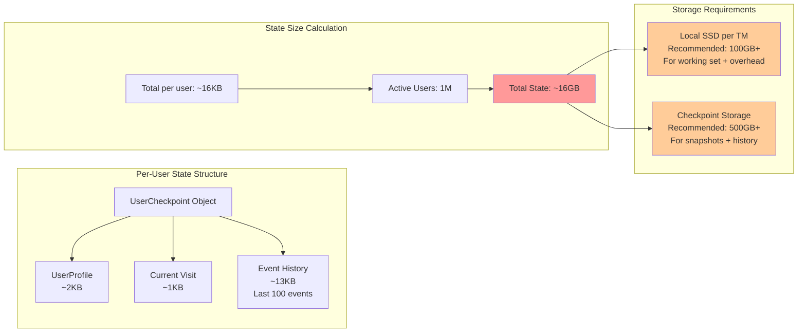

---

## Scaling Considerations

### Horizontal Scaling Strategy

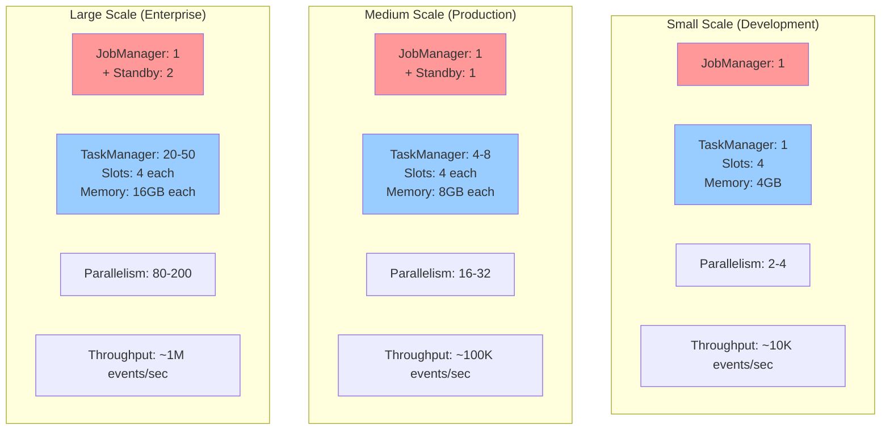

### Resource Allocation Guidelines

| Component | Small Scale | Medium Scale | Large Scale |
|-----------|-------------|--------------|-------------|
| **JobManager** | 1 instance<br/>2 CPU, 4GB RAM | 1 active + 1 standby<br/>4 CPU, 8GB RAM | 1 active + 2 standby<br/>8 CPU, 16GB RAM |
| **TaskManager** | 1 instance<br/>4 slots, 4GB RAM | 4-8 instances<br/>4 slots, 8GB RAM each | 20-50 instances<br/>4 slots, 16GB RAM each |
| **Parallelism** | 2-4 | 16-32 | 80-200 |
| **Kafka Partitions** | 4 | 16-32 | 80-200 |
| **Local State Storage** | 50GB SSD | 100GB SSD per TM | 200GB NVMe per TM |
| **Checkpoint Storage** | 100GB | 500GB | 2TB+ |
| **Network Bandwidth** | 1 Gbps | 10 Gbps | 25 Gbps |

### State TTL and Cleanup

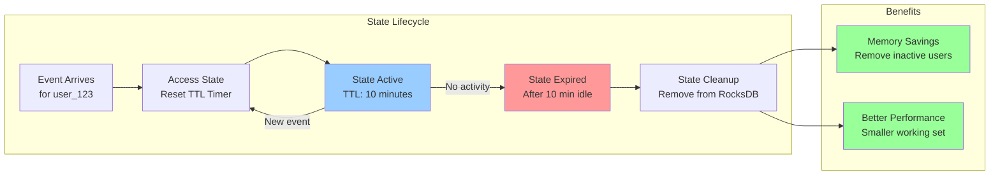

---

## Deployment Configuration

### Recommended Flink Configuration for Large Scale

```yaml
# JobManager Configuration
jobmanager:
  memory:
    process.size: 8g
    jvm-overhead.fraction: 0.1
  rpc.address: flink-jobmanager
  rpc.port: 6123
  web.port: 8081

# TaskManager Configuration  
taskmanager:
  memory:
    process.size: 16g
    managed.fraction: 0.4  # 6.4GB for RocksDB
    network.fraction: 0.1   # 1.6GB for network buffers
  numberOfTaskSlots: 4
  
# State Backend Configuration
state:
  backend: rocksdb
  backend.incremental: true
  backend.rocksdb.localdir: /data/rocksdb
  checkpoints.dir: s3://flink-checkpoints/
  savepoints.dir: s3://flink-savepoints/
  
# Checkpoint Configuration
execution:
  checkpointing:
    interval: 60000  # 60 seconds
    mode: EXACTLY_ONCE
    timeout: 600000  # 10 minutes
    max-concurrent-checkpoints: 1
    min-pause: 30000  # 30 seconds between checkpoints
```

### Volume Requirements

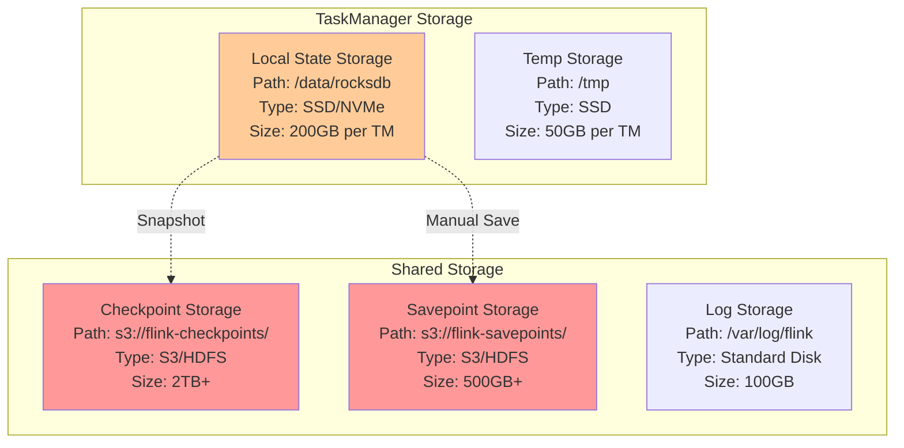

---

## Monitoring and Observability

### Key Metrics to Monitor

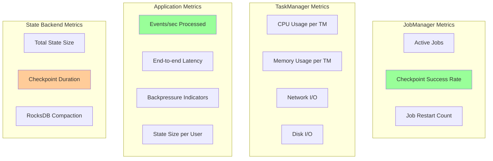

---

## Failure Recovery

### Checkpoint and Recovery Flow

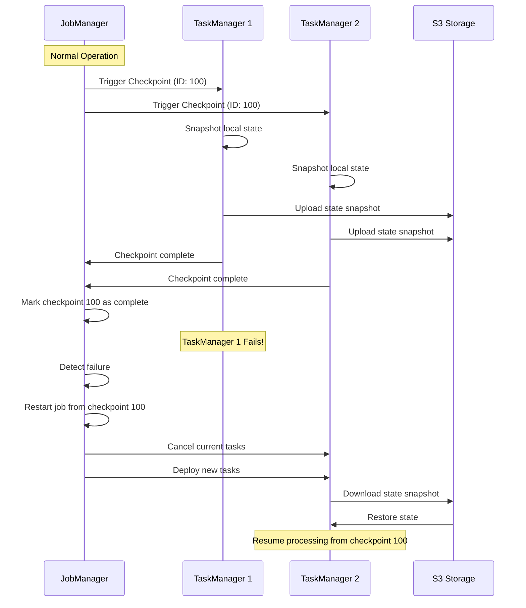

---

## Summary

This architecture supports:

- **High Throughput**: Process millions of events per second
- **Large State**: Handle up to 16MB per user with efficient storage
- **Fault Tolerance**: Exactly-once processing with checkpoint recovery
- **Horizontal Scaling**: Add TaskManagers to increase capacity
- **State Management**: Efficient RocksDB backend with TTL cleanup
- **Monitoring**: Comprehensive metrics for operations

For production deployment, ensure:
1. Adequate local SSD storage for RocksDB state
2. Reliable distributed storage (S3/HDFS) for checkpoints
3. Sufficient network bandwidth between components
4. Proper resource allocation based on expected load
5. Monitoring and alerting on key metrics
