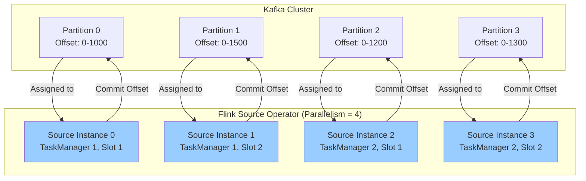
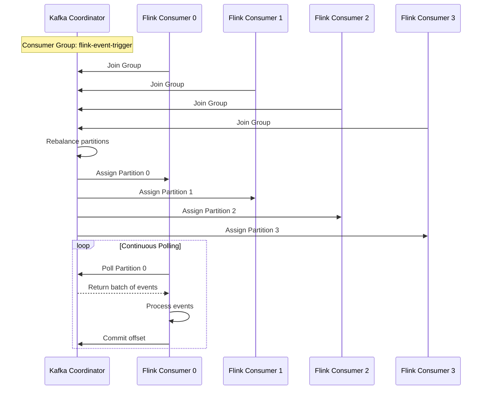
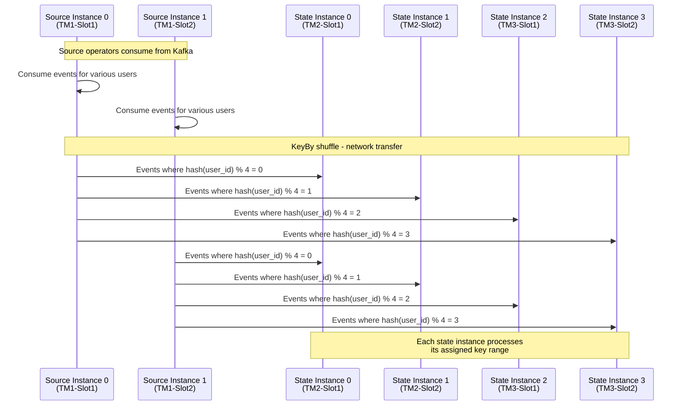
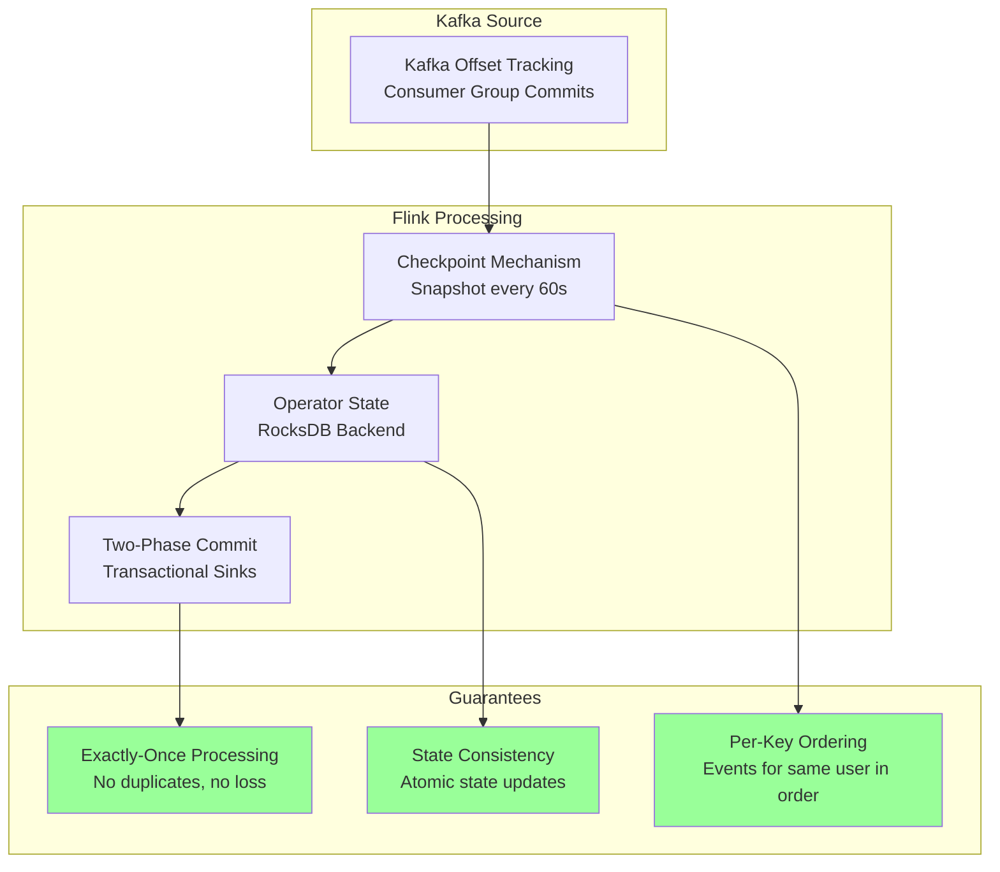
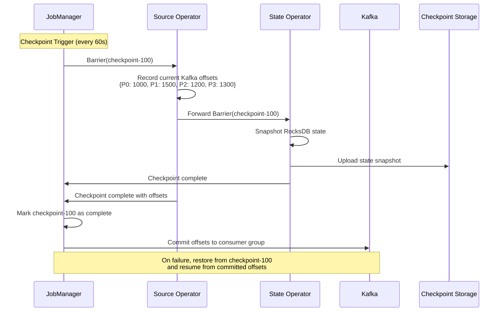
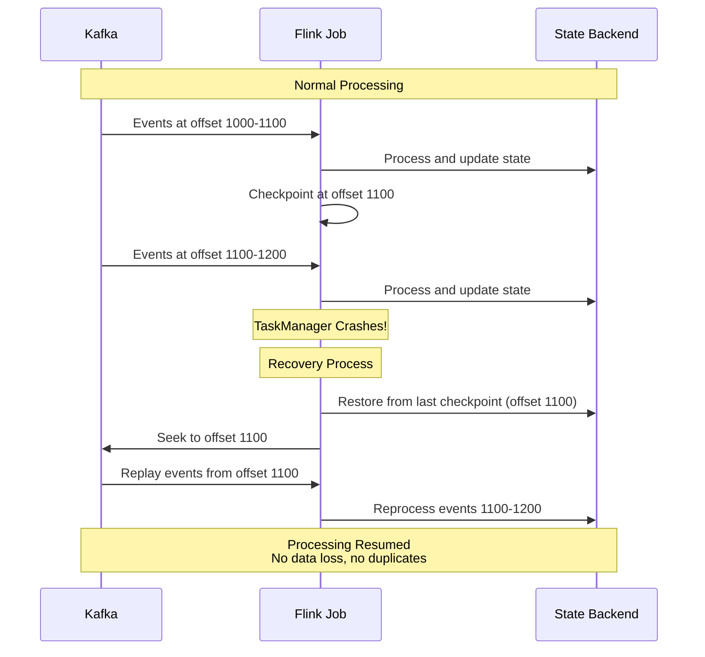
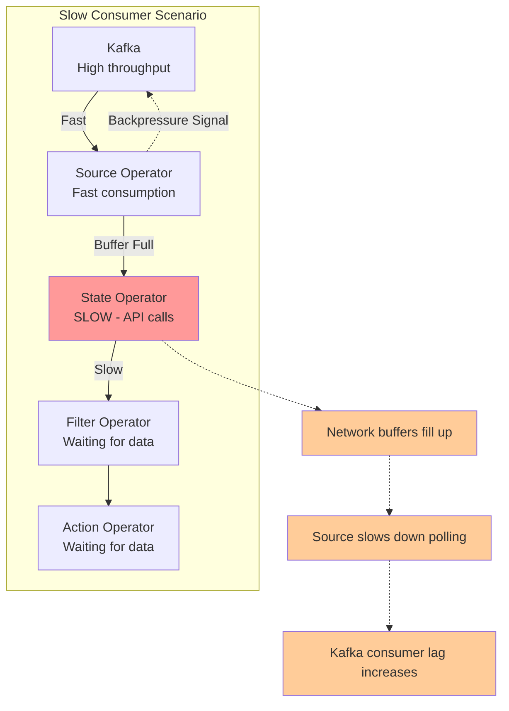
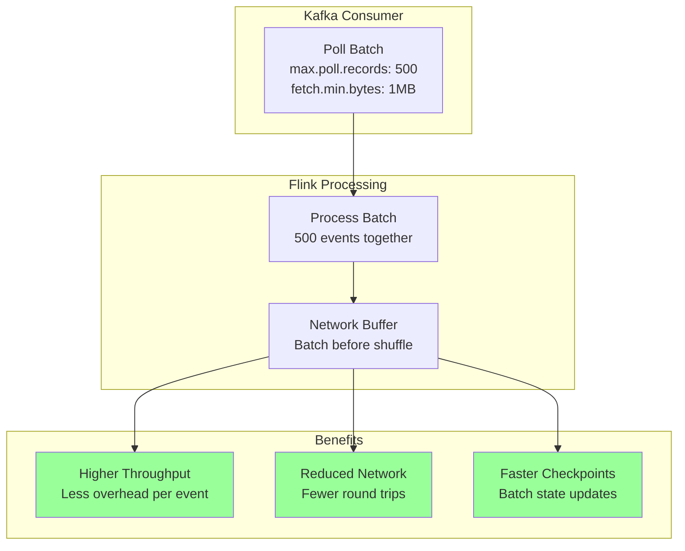

# Event Payload Dispatch - Kafka to Flink Job

## Overview

This document provides detailed information about how user tracking events flow from Kafka through the Flink job pipeline, including partitioning strategies, payload structure, and processing guarantees.

## Table of Contents

1. [Event Payload Structure](#event-payload-structure)
2. [Kafka Partitioning Strategy](#kafka-partitioning-strategy)
3. [Flink Consumer Assignment](#flink-consumer-assignment)
4. [Event Routing and KeyBy](#event-routing-and-keyby)
5. [Processing Guarantees](#processing-guarantees)

---

## Event Payload Structure

### Raw Event JSON Schema

```json
{
  "event_id": "evt_001",
  "user_id": "user_123",
  "domain": "example.com",
  "is_first_in_visit": true,
  "is_last_in_visit": false,
  "is_first_event": true,
  "is_current": true,
  "event_name": "page_view",
  "event_displayname": "Page View",
  "integration": "web",
  "app": "main_app",
  "platform": "web",
  "is_https": true,
  "event_type": "pageview",
  "duration": 0,
  "timestamp": 1704067200000,
  "triggerable": true,
  "parameters": {
    "custom_params": {
      "page_title": "Home Page",
      "page_url": "https://example.com/",
      "referrer": "https://google.com"
    },
    "utm_source": "google",
    "utm_campaign": "spring_sale",
    "utm_content": "banner_ad",
    "utm_medium": "cpc",
    "utm_term": "shoes",
    "utm_id": "camp_001"
  }
}
```

### Event Size Characteristics

| Metric | Typical Value | Maximum Value |
|--------|---------------|---------------|
| Event Size | 500 bytes - 2KB | 10KB |
| Events per User per Session | 10-50 | 500 |
| Events per Second (Total) | 10K - 1M | 10M |
| Unique Users per Day | 100K - 10M | 100M |

---

## Kafka Partitioning Strategy

### Partition Assignment Logic

```mermaid
graph TB
    subgraph "Event Producer"
        Event[User Event<br/>user_id: "user_123"]
        Hash[Hash Function<br/>hash(user_id)]
        PartitionCalc[Partition = hash % num_partitions]
    end
    
    subgraph "Kafka Topic: user-tracking-events"
        P0[Partition 0<br/>user_id hash % 4 = 0]
        P1[Partition 1<br/>user_id hash % 4 = 1]
        P2[Partition 2<br/>user_id hash % 4 = 2]
        P3[Partition 3<br/>user_id hash % 4 = 3]
    end
    
    Event --> Hash
    Hash --> PartitionCalc
    
    PartitionCalc -->|hash % 4 = 0| P0
    PartitionCalc -->|hash % 4 = 1| P1
    PartitionCalc -->|hash % 4 = 2| P2
    PartitionCalc -->|hash % 4 = 3| P3
    
    style P0 fill:#99ccff
    style P1 fill:#99ccff
    style P2 fill:#99ccff
    style P3 fill:#99ccff
```

### Why Partition by user_id?

**Key Benefits:**
1. **Ordering Guarantee**: All events for a user go to the same partition, maintaining order
2. **State Locality**: Same user always processed by same Flink task (after KeyBy)
3. **Load Distribution**: Hash function distributes users evenly across partitions
4. **Scalability**: Can increase partitions to handle more throughput

**Example Distribution:**
```
user_123 → hash(user_123) = 12345 → 12345 % 4 = 1 → Partition 1
user_456 → hash(user_456) = 67890 → 67890 % 4 = 2 → Partition 2
user_789 → hash(user_789) = 11111 → 11111 % 4 = 3 → Partition 3
user_abc → hash(user_abc) = 88888 → 88888 % 4 = 0 → Partition 0
```

---

## Flink Consumer Assignment

### Consumer to Partition Mapping



### Consumer Group Coordination



---

## Event Routing and KeyBy

### From Kafka Partition to Flink State Partition

```mermaid
graph TB
    subgraph "Kafka Partitions"
        KP0[Partition 0<br/>Users: 0,4,8,12...]
        KP1[Partition 1<br/>Users: 1,5,9,13...]
        KP2[Partition 2<br/>Users: 2,6,10,14...]
        KP3[Partition 3<br/>Users: 3,7,11,15...]
    end
    
    subgraph "Flink Source (Parallelism = 4)"
        FS0[Source 0]
        FS1[Source 1]
        FS2[Source 2]
        FS3[Source 3]
    end
    
    subgraph "KeyBy Shuffle"
        KeyBy[KeyBy user_id<br/>Repartition by hash]
    end
    
    subgraph "Flink State Operator (Parallelism = 4)"
        State0[State Instance 0<br/>Key Range: 0-31]
        State1[State Instance 1<br/>Key Range: 32-63]
        State2[State Instance 2<br/>Key Range: 64-95]
        State3[State Instance 3<br/>Key Range: 96-127]
    end
    
    KP0 --> FS0
    KP1 --> FS1
    KP2 --> FS2
    KP3 --> FS3
    
    FS0 --> KeyBy
    FS1 --> KeyBy
    FS2 --> KeyBy
    FS3 --> KeyBy
    
    KeyBy -->|hash(user_id) % 4 = 0| State0
    KeyBy -->|hash(user_id) % 4 = 1| State1
    KeyBy -->|hash(user_id) % 4 = 2| State2
    KeyBy -->|hash(user_id) % 4 = 3| State3
    
    style KeyBy fill:#ffcc99
    style State0 fill:#99ccff
    style State1 fill:#99ccff
    style State2 fill:#99ccff
    style State3 fill:#99ccff
```

### KeyBy Repartitioning Example

**Important**: Kafka partition assignment and Flink KeyBy partitioning are independent!

```
Event Flow Example:

1. Event arrives at Kafka:
   user_id: "user_123" → Kafka Partition 1

2. Flink Source Instance 1 consumes from Kafka Partition 1

3. KeyBy repartitions:
   hash("user_123") % 4 = 2 → Routes to State Instance 2

4. State Instance 2 processes event:
   - Loads state for user_123
   - Enriches event
   - Forwards to next operator
```

### Network Shuffle During KeyBy



---

## Processing Guarantees

### Exactly-Once Semantics



### Checkpoint and Offset Coordination



### Failure Recovery Scenario



---

## Event Processing Latency

### End-to-End Latency Breakdown

```mermaid
graph LR
    subgraph "Latency Components"
        Producer[Producer Latency<br/>1-5ms]
        KafkaWrite[Kafka Write<br/>5-20ms]
        KafkaPoll[Kafka Poll<br/>10-100ms]
        Deserialize[Deserialization<br/>1-2ms]
        StateRead[State Read<br/>1-10ms]
        APICall[API Call<br/>10-100ms<br/>(on cache miss)]
        Filter[Filter Eval<br/>1-5ms]
        Action[Action Execute<br/>5-50ms]
    end
    
    Producer --> KafkaWrite
    KafkaWrite --> KafkaPoll
    KafkaPoll --> Deserialize
    Deserialize --> StateRead
    StateRead --> APICall
    APICall --> Filter
    Filter --> Action
    
    style APICall fill:#ff9999
    style Action fill:#ffcc99
```

**Typical Latency:**
- **Best Case** (cache hit): 30-100ms
- **Average Case** (some cache misses): 100-300ms
- **Worst Case** (API timeout): 5-10 seconds

---

## Backpressure Handling

### Backpressure Flow



### Monitoring Backpressure

**Key Metrics:**
- `buffers.inPoolUsage`: Network buffer usage (>80% = backpressure)
- `buffers.outPoolUsage`: Output buffer usage
- `records-lag-max`: Kafka consumer lag
- `checkpointDuration`: Increasing checkpoint time

**Mitigation Strategies:**
1. Increase parallelism
2. Optimize slow operators (cache API calls)
3. Add more TaskManagers
4. Increase Kafka partitions
5. Tune network buffer configuration

---

## Payload Transformation Pipeline

### Event Enrichment Flow

```mermaid
graph LR
    subgraph "Input"
        RawEvent[Raw Event<br/>500 bytes<br/>Basic fields only]
    end
    
    subgraph "Enrichment"
        Deserialize[Deserialize<br/>JSON → POJO]
        LoadState[Load State<br/>UserCheckpoint<br/>16KB]
        FetchAPI[Fetch API Data<br/>(if needed)<br/>Profile + Visit + History]
        Merge[Merge Data<br/>Create EnrichedEvent]
    end
    
    subgraph "Output"
        EnrichedEvent[Enriched Event<br/>~20KB<br/>Full context]
    end
    
    RawEvent --> Deserialize
    Deserialize --> LoadState
    LoadState --> FetchAPI
    FetchAPI --> Merge
    Merge --> EnrichedEvent
    
    style RawEvent fill:#99ccff
    style EnrichedEvent fill:#99ff99
```

### Enriched Event Structure

```json
{
  "event": {
    "event_id": "evt_001",
    "user_id": "user_123",
    "event_name": "page_view",
    "timestamp": 1704067200000,
    "parameters": { ... }
  },
  "userProfile": {
    "user_id": "user_123",
    "country": "US",
    "city": "New York",
    "language": "en",
    "timezone": "America/New_York"
  },
  "currentVisit": {
    "visit_id": "visit_456",
    "start_time": 1704067000000,
    "page_count": 5,
    "is_first_visit": false
  },
  "eventHistory": [
    {
      "event_id": "evt_000",
      "event_name": "session_start",
      "timestamp": 1704067000000
    },
    // ... last 100 events
  ]
}
```

---

## Performance Optimization

### Batching Strategy



### Recommended Configuration

```yaml
# Kafka Consumer Configuration
kafka:
  consumer:
    max.poll.records: 500
    fetch.min.bytes: 1048576  # 1MB
    fetch.max.wait.ms: 500
    max.partition.fetch.bytes: 10485760  # 10MB

# Flink Configuration
flink:
  execution:
    buffer-timeout: 100  # ms
  network:
    buffers-per-channel: 2
    extra-buffers-per-gate: 8
```

---

## Summary

**Key Takeaways:**

1. **Partitioning**: Events partitioned by `user_id` in both Kafka and Flink for consistency
2. **Parallelism**: Match Flink parallelism to Kafka partition count for optimal throughput
3. **Guarantees**: Exactly-once processing with checkpoint-based recovery
4. **Latency**: 30-300ms typical end-to-end latency
5. **State Size**: ~16KB per user, requires adequate storage provisioning
6. **Scalability**: Horizontal scaling by adding partitions and TaskManagers

**Best Practices:**

- Keep Kafka partition count = Flink parallelism
- Monitor consumer lag and backpressure
- Use incremental checkpoints for large state
- Provision adequate local SSD storage
- Cache API calls to reduce latency
- Set appropriate TTL for state cleanup
